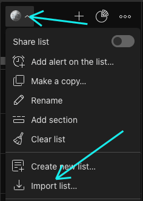
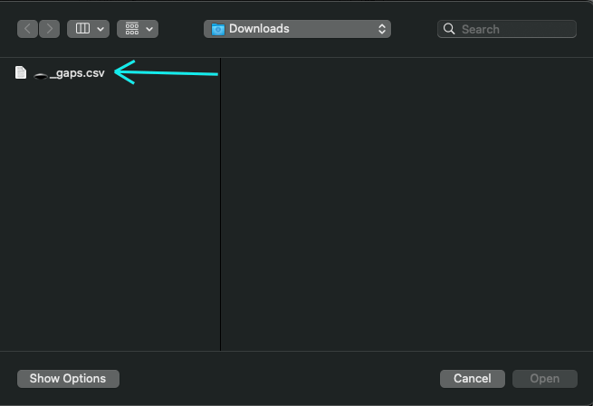
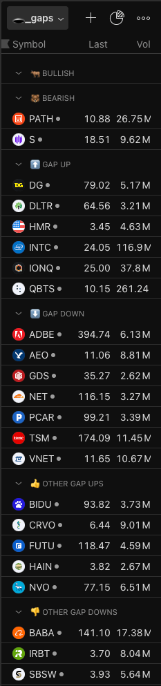

# Gaps List

Simple node.js program(s) that format and filter daily gaps into a tradingview watch list.

- `format.js` formats an expected `Gaps\ \ \&\ Earnings\ -\ Gaps\ List.csv` to a [trading view watchlist](https://www.tradingview.com/support/solutions/43000487233-how-to-import-or-export-watchlist/) compatible format
- `filter.js` filters out tickers with low volume, too low and too high prices

## Quick Start

Project setup and execution:

```bash
$ npm install

$ node format.js

$ node filter.js
```

**Import List**:



**Select file**:



**Watch list**:



## format.js

Program is expecting filename to be `Gaps & Earnings - Gaps List.csv`

Expecting `csv` to be formatted like:

```csv
,,,,,,,,,,,,,,
,Complete List,,,Trimmed List,,,Favorite Gaps,,,"""Unique"" Gaps",,,,
,Up ,Down,,Up ,Down,,Bullish,Bearish,,Secondary,Ex-div,Spin-off,Buyout,Split
,ACNT,ADBE,,ACNT,ADBE,,FEMY,PATH,,ATEN (notes),,,,
,ADV,ADTX,,ADV,AEO,,,S,,SPIR,,,,
,AISPW,AEO,,CCLD,ATEN,,,CERO,,,,,,
,AVAH,AEYE,,DG,CERO,,,,,,,,,
,BBW,AIEV,,DLTR,CMI,,,,,,,,,
,BIDU,AREB,,FEMY,CMTL,,,,,,,,,
,BKYI,ATEN,,GIII,CSCI,,,,,,,,,
,CCLD,BABA,,HMR,DLTH,,,,,,,,,
,CRVO,BHAT,,INTC,GDS,,,,,,,,,
,DG,BTMD,,IONQ,MNSO,,,,,,,,,
,DLTR,BURU,,LUCK,NET,,,,,,,,,
,DMN,CDLX,,MGTX,NOVA,,,,,,,,,
,FEMY,CLRB,,QBTS,PATH,,,,,,,,,
,FFNW,CMI,,RAIL,PCAR,,,,,,,,,
,FN,CMTL,,SATL,S,,,,,,,,,
,FUTU,CSCI,,XCUR,SAP,,,,,,,,,
,GIII,CTMX,,WCT,SPIR,,,,,,,,,
,HAIN,DLTH,,,SSL,,,,,,,,,
,HMR,ECOR,,,TSM,,,,,,,,,
,INTC,GDS,,,VNET,,,,,,,,,
,INTW,HCTI,,,,,,,,,,,,
,IONQ,HEPA,,,,,,,,,,,,
,IONX,HIT,,,,,,,,,,,,
,IPA,HPH,,,,,,,,,,,,
,LUCD,IRBT,,,,,,,,,,,,
,LUCK,MNSO,,,,,,,,,,,,
,MGTX,MXCT,,,,,,,,,,,,
,MYNZ,NOVA,,,,,,,,,,,,
,NVO,ONCO,,,,,,,,,,,,
,NYXH,PALI,,,,,,,,,,,,
,ODC,PATH,,,,,,,,,,,,
,PHAR,PBM,,,,,,,,,,,,
,QBTS,PCAR,,,,,,,,,,,,
,QMMM,PESI,,,,,,,,,,,,
,RAIL,PSTV,,,,,,,,,,,,
,RNAZ,PWM,,,,,,,,,,,,
,SATL,S,,,,,,,,,,,,
,SNES,SAP,,,,,,,,,,,,
,SPGC,SBSW,,,,,,,,,,,,
,TRNR,SCNX,,,,,,,,,,,,
,UPB,SOUNW,,,,,,,,,,,,
,WLGS,SPHL,,,,,,,,,,,,
,XCUR,SPIR,,,,,,,,,,,,
,ZBIO,SSL,,,,,,,,,,,,
,WCT,STI,,,,,,,,,,,,
,,TSM,,,,,,,,,,,,
,,ULY,,,,,,,,,,,,
,,VNET,,,,,,,,,,,,
,,VSTE,,,,,,,,,,,,
```

Usage:

```bash
$ node format.js
```

## filter.js

Program is expecting filename to be `complete_list.csv`

Expecting `csv` to be formatted like:

```csv
###🐂 Bullish
FEMY

###🐻 Bearish
PATH
S
CERO

###⬆️ Gap Up
ACNT
ADV
CCLD
DG
DLTR
FEMY
GIII
HMR
INTC
IONQ
LUCK
MGTX
QBTS
RAIL
SATL
XCUR
WCT

###⬇️ Gap Down
ADBE
AEO
ATEN
CERO
CMI
CMTL
CSCI
DLTH
GDS
MNSO
NET
NOVA
PATH
PCAR
S
SAP
SPIR
SSL
TSM
VNET

###👍 Other Gap Ups
AISPW
AVAH
BBW
BIDU
BKYI
CRVO
DMN
FFNW
FN
FUTU
HAIN
INTW
IONX
IPA
LUCD
MYNZ
NVO
NYXH
ODC
PHAR
QMMM
RNAZ
SNES
SPGC
TRNR
UPB
WLGS
ZBIO

###👎 Other Gap Downs
ADTX
AEYE
AIEV
AREB
BABA
BHAT
BTMD
BURU
CDLX
CLRB
CTMX
ECOR
HCTI
HEPA
HIT
HPH
IRBT
MXCT
ONCO
PALI
PBM
PESI
PSTV
PWM
SBSW
SCNX
SOUNW
SPHL
STI
ULY
VSTE
```

Usage:

```bash
$ node filter.js
```

You can change the options:

```bash
Usage: node filter-tickers.js [inputFile] [outputFile] [options]

Arguments:
  inputFile     Path to the input CSV file (default: ${INPUT_FILE})
  outputFile    Path to the output CSV file (default: ${OUTPUT_FILE})

Options:
  --cache-only  Use only cached volume and price data (no API calls)
  --help        Display this help information

Examples:
  node filter-tickers.js
  node filter-tickers.js my_watchlist.csv filtered_watchlist.csv
  node filter-tickers.js --cache-only
```

## Shell Alias

Recommend adding this to your your `rc` (`.zshrc`, `.bashrc`) so anywhere in the terminal you can just execute:

`$ gaps`

Takes some strong opinionated conventions of filenames and paths though

```bash
function gaps() {
    # Set up paths
    DOWNLOAD_DIR="$HOME/Downloads"
    WATCHLIST_DIR="$HOME/code/watchlist"
    INPUT_FILE="Gaps  & Earnings - Gaps List.csv"
    FORMATTED_OUTPUT="🕳️_gaps.csv"

    # Move downloaded file to watchlist directory
    mv "$DOWNLOAD_DIR/$INPUT_FILE" "$WATCHLIST_DIR/"
    cd "$WATCHLIST_DIR"

    # Clean up previous files
    rm -f complete_list.csv \
          price_cache.json \
          volume_cache.json \
          filtered_list_report.txt \
          filtered_list.csv \
          2>/dev/null || true

    # Process data
    echo "Formatting data..."
    node format.js

    echo "Filtering tickers..."
    node filter.js

    # Move result back to downloads
    cp filtered_list.csv "$FORMATTED_OUTPUT"
    mv "$FORMATTED_OUTPUT" "$DOWNLOAD_DIR/"

    # Return to downloads directory
    cd "$DOWNLOAD_DIR/"

    echo "✅ Process complete! Filtered gaps file available in Downloads."
}
```
